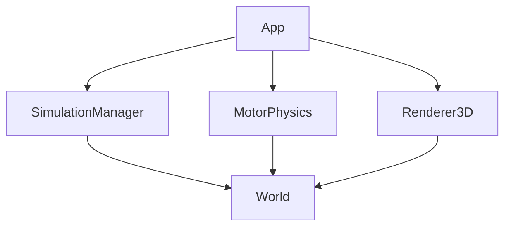

# 🪐Planetary System simulator 3D without opengl and no engine🌍

## 📋 Sommaire

1. **🎯 À Propos** 
2. **🚩 Fonctionnalités**
3. **🚀 Quick Start**
4. **📃 Documentation**
5. **🛠️ Technologies**
6. **📸 Captures d'Écran**
7. **📝 Licence**
8. **👥 Auteur**

---
## 🎯 À Propos

**Plannetary System Simulator 3D** est un simulateur éducatif capable de simuler un système solaire comme en conditions réel

### Pourquoi ce Projet

Le Projet a été créer dans le cadre d'un Devoir contrairement à un simulateur classique il ne préentre pas les orbites il laisse les forces du monde les matérialiser

### Cas d'Usage

- 🔬 Recherche en astrophysique
- 🎓 Enseignement de la mécanique céleste
- 🎮 Création de simulations pour jeux vidéo

---
## 🚩 Fonctionnalités Principales

### 🌌 Moteur Physique
- **Simulation N-corps** : Gravity engine avec algorithme Velocity Verlet
- **Détection de collisions** : 4 modes (élastique, fusion, destruction, none)
- **Forces réalistes** : Newton + softening gravitationnel

### 🎨 Rendu 3D
- **Pipeline de Rendu Custom** : Rasterisation perspective-correct
- **3 modes de rendu** : Filled, Wireframe, Points
- **Éclairage dynamique** : Modèle Phong avec sources multiples

### 🎮 Interface
- **Caméra libre** : 6 axes de mouvement avec modes vol/marche
- **Contrôles intuitifs** : ZQSD + souris
- **UI ImGui** : Gestion des scènes en temps réel(en cours)

### 📦 Gestion de Scènes
- **Format .wrld** : Syntaxe simple et lisible
- **Chargement dynamique** : Hot-reload des simulations
- **Tests intégrés** : Système Solaire, Alpha Centauri, Kepler-16

---
## 🚀 Quick Start

### Prérequis

- C++17 ou supérieur
- python
- SDL3
- ImGui

### Installation en 3 étapes

```bash
# 1. Cloner le repo
git clone https://github.com/Beginsangod/Planetary_System_simulator_3D_without_opengl_and_no_engine
cd Planetary_System_simulator_3D_without_opengl_and_no_engine

# 2. Clear le chemin de compilation au cas où
python -u build.py clear

# 3. Compiler
python -u build.py build

# 4. Lancer
python -u build.py run
```

### Exemple

Dans un Fichier .wrld dans le dossier world
```wrld
World {
    Star(pos(0,0,0), 100, 5, 50, color(1,1,0.8), 5778k)
    Planet(pos(10,0,0), 1, 0.6, color(0.2,0.4,0.8), RotSpeed(0,1,0), 23.5)
}
```
Lancer Directement pas Besoin de recompiler

**Press F1** pour voir les commnades de déplacemment
**Press F2** pour voir le manager de scène

**✨✨Félicitations !🧨🧨** Vous avez créé votre premier système étoile-planète

---
## 📃 Documentation

### 📘Guides

#### Architectures du Projet

```txt

Planetary_System_simulator_3D_without_opengl_and_no_engine/
|   build.py  // Fichier de compilation nettoyage et lancement du programme
|   imgui.ini
|   LICENSE
|   README.md
|   SDL3.dll
|   SDL3_image.dll
|
+---Build     // Fichier obtenu après Build
|   |   imgui.ini
|   |   SDL3.dll
|   |   SDL3_image.dll
|   |   SimulateurPlanetaire3D.exe
|   |
|   \---obj  // Fichiers .o
|
+---src
|   |   main.cpp
|   |
|   +---core  // Coeur de l'application réunion des différents éléments
|   |   |
|   |   +---Event  // Gestion d'évènnement
|   |   |
|   |   \---math // Modules mathématique
|   |
|   +---graphics // Moteur de Rendu 3d
|   |
|   +---physics   // Moteur de physics
|   |
|   \---Simulation // Gestion du DSL maison et du management des scènes
|
+---ThirdParty     // Imgui 
|   |
|   \---backends
|
\---world      // Dossier de récupération des fichiers .wrld

```
#### Syntaxe des Fichiers world

```txt 

// pos() donner une position à vos éléments
// color() donner une couleur à vos éléments
// RotSpeed() uniquement pour planète pour le calcule vitesse de rotation sur son propre axe
// chaque valeur est un float l'échelle du monde est le suivant :
//mass 1 unité = 10^24 kg et 1 unité = 1 million de km

World {
    // méthode de création de planetes 
    Star(mass, radius, luminosity, temperature, pos(x, y, z), color(x, y, z))
    Planete(mass, radius, AxialTilt, pos(x, y, z), color(x, y, z), RotSpeed(x, y, z))
    Satellite(mass, radius, pos(x, y, z), color(x, y, z))

    // méthode de création d'objet 3D uniquement accessible par les fichiers .wrld
    plane(width, height, pos(x, y, z), color(x, y, z))
    Cube(size, pos(x, y, z))
    Sphere(radius, SectorCount, stackCount, pos(x, y, z), color(x, y, z))
    Light(radius, SectorCount, stackCount, IntensitéLumineuse, pos(x, y, z), color(x, y, z))
}

```

#### Diagrammes

### 📊 Diagrammes



---
## 🛠️ Technologies

### Langage & Standards
- **C++17** : Modern C++ features
- **STL** : Containers, algorithms, smart pointers

### Bibliothèques
- **SDL3** : Windowing, input, rendering context
- **ImGui** : Immediate mode GUI

### Mathématiques
- **Implémentation custom** : Vector2,Vector3, Matrix4x4
- **Algorithmes** : Velocity Verlet

### Build System
- **Python script** : Build automation, cross-platform build, run and clean

---
## 📸 Captures d'Écran

---
## 📝 Licence

Distribué sous licence MIT. Voir `LICENSE` pour plus d'informations.

En résumé :

- **✅ Usage commercial autorisé**
- **✅ Modification autorisée**
- **✅ Distribution autorisée**
- **⚠️ Attribution requise**
- **⚠️ Licence incluse dans distributions**

---
## 👥 Auteurs

- **Beginsangod** - *Travail initial* - [GitHub](https://github.com/Beginsangod)

---
## 📞 Contact

- 💬 GitHub Discussions : [Discussions](https://github.com/Beginsangod/Planetary_System_simulator_3D_without_opengl_and_no_engine/Discussion)
- 🐦 Twitter : [@MonTwitter](https://twitter.com/Beginsan2_0)
- 📧 Email : Beginsan2.0@proton.me

---

<p align="center">
  Fait avec ❤️ et ☕ pour l'exploration spatiale✨
</p>

<p align="center">
  <sub>⭐ Si ce projet vous plaît, n'hésitez pas à mettre une étoile !</sub>
</p>